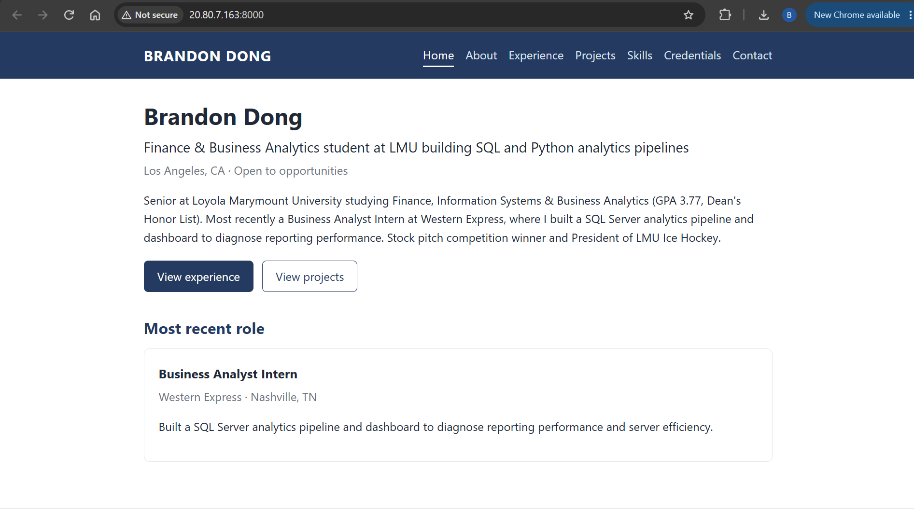

# Exercise 03 evidence: build it, then move it

## 1. The VM

| Field | Value |
|---|---|
| Name | `vm-career-platform` |
| Resource group | `rg-career-platform` |
| Region | North Central US (`northcentralus`) |
| Size | `Standard_B2ats_v2` (2 vCPU, 1 GiB memory, x64) |
| Image | Ubuntu Server 24.04 LTS, x64 Gen2 |
| Public IP | `20.80.7.163` |

## 2. The site at the VM's public IP

Taken 2026-09-30 while the `Temp-HTTP-8000` rule was open. The rule allowed only my laptop's IP, and I deleted it right after. Port 8000 is closed again, and the app listens only on `127.0.0.1`.

## 3. Issues

The Azure VM West US 2 Region from the spec wasn't compatible with my student plan, so I instructed Claude to use the Azure CLI to investigate any regions that were compatible with the lowest possible price. Claude found that the student plan only allows five regions: West US, North Central US, Mexico Central, France Central, and Sweden Central. Claude then looked through the compatability of the different plans, and initially encountered an issue with the North Central US region, as Standard_B2ts_v2 size wasn't offered in the region. However, Claude found that Standard_B2ats_v2 had the same 2 vCPU and 1 GiB for the price of $6.86 a month, so I pivoted to that region and plan instead. The confirmation was that the VM deployed and showed "VM running" on the Azure website.

The database was empty. When implementing the migration plan, Claude found that career_platform.db was 0 bytes with no tables, so the site would be pulling empty data. To fix it, I put my resume into the chat in pdf form, and loaded the data from my resume into the database. The confirmation was that the copies from my laptop and the VM had matching hashes, and the page in the browser correctly showed my headline.

## 4. The change

> You're at a coffee shop and try to SSH into your VM to fix a typo. The command hangs.

The SSH rule we set up in Azure allows only my public IP from the LMU Hilton router, so whenever I go to a different location and connect to the internet, my public IP will be different. Therefore, I wouldn't be able to connect to the VM from a different location than where I physically set it up from. To fix it, I would update the Allow-SSH-Laptop rule to allow my new public IP by going to ifconfig.me and giving Claude my new public IP and telling it to use the Azure CLI to update the rule accordingly. The cost of doing this would be a couple minutes to get my new IP every time I change networks and instruct Claude.
